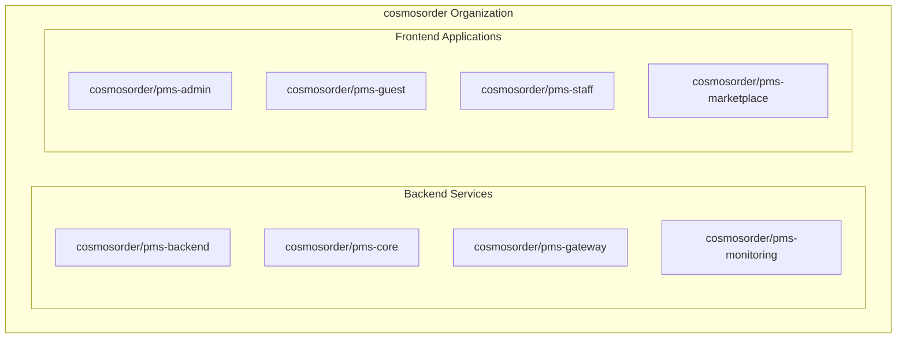
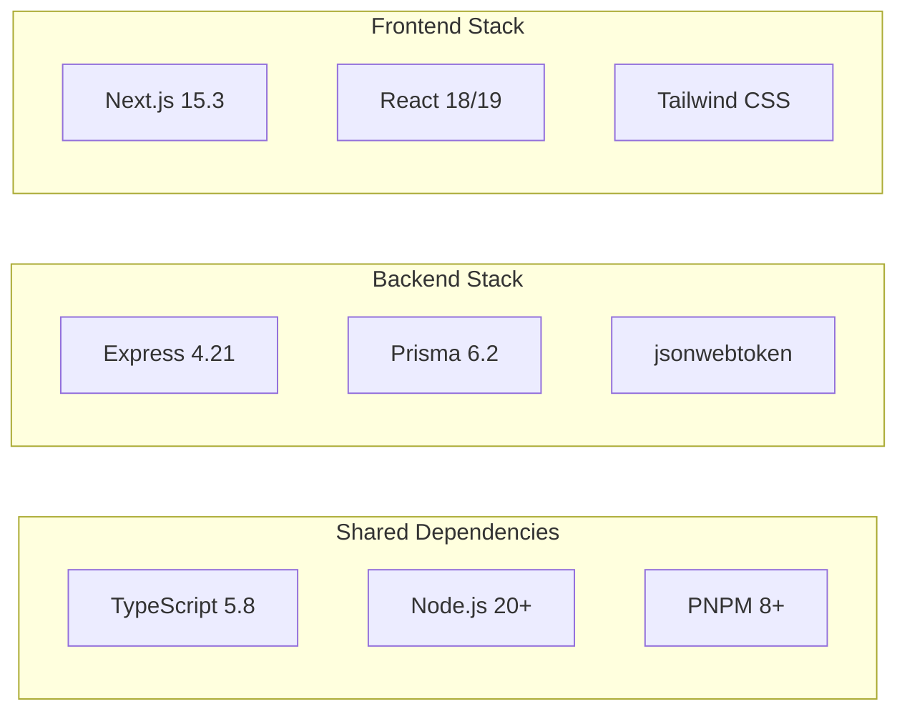

# 🚀 PMS Repository Deployment Strategy

## 📋 Executive Summary
Transform the monolithic PMS platform into 8 independent private repositories under the **cosmosorder** organization, enabling parallel development, improved CI/CD, and reduced token usage.

## 🎯 Deployment Architecture



## 📦 Repository Structure

### 1. **cosmosorder/pms-backend** (Core API)
- **Port**: 5000
- **Tech**: Express, TypeScript, Prisma, SQLite/PostgreSQL
- **Purpose**: Business logic, database operations, API endpoints
- **Dependencies**: pms-core (for auth)

### 2. **cosmosorder/pms-core** (Authentication Service)
- **Port**: 3000
- **Tech**: Express, TypeScript, JWT
- **Purpose**: Service-to-service authentication, token management
- **Dependencies**: None (standalone)

### 3. **cosmosorder/pms-gateway** (API Gateway)
- **Port**: 8080
- **Tech**: Express, TypeScript, http-proxy-middleware
- **Purpose**: Central routing, load balancing, service discovery
- **Dependencies**: All services (routing only)

### 4. **cosmosorder/pms-monitoring** (Health Dashboard)
- **Port**: 9090
- **Tech**: Express, TypeScript, WebSocket
- **Purpose**: Real-time health monitoring, metrics collection
- **Dependencies**: All services (health checks)

### 5. **cosmosorder/pms-admin** (Admin Dashboard)
- **Port**: 3010
- **Tech**: Next.js 15, TypeScript, React 19
- **Purpose**: Property management interface for administrators
- **Dependencies**: pms-gateway (API calls)

### 6. **cosmosorder/pms-guest** (Guest Portal)
- **Port**: 3011
- **Tech**: Next.js 15, TypeScript, React 19
- **Purpose**: Guest booking and services interface
- **Dependencies**: pms-gateway (API calls)

### 7. **cosmosorder/pms-staff** (Staff Mobile PWA)
- **Port**: 3012
- **Tech**: Next.js 15, TypeScript, React 18, PWA
- **Purpose**: Mobile app for housekeeping and maintenance
- **Dependencies**: pms-gateway (API calls)

### 8. **cosmosorder/pms-marketplace** (Property Marketplace)
- **Port**: 3013
- **Tech**: Next.js 15, TypeScript, React 19
- **Purpose**: Property listings, sales, and rentals
- **Dependencies**: pms-gateway (API calls)

## 🔧 Deployment Steps

### Phase 1: Repository Creation
```bash
# Authenticate with GitHub CLI
gh auth login --hostname github.com

# Create all repositories
gh repo create cosmosorder/pms-backend --private --description "PMS Backend API Service"
gh repo create cosmosorder/pms-core --private --description "PMS Authentication Service"
gh repo create cosmosorder/pms-gateway --private --description "PMS API Gateway"
gh repo create cosmosorder/pms-monitoring --private --description "PMS Monitoring Dashboard"
gh repo create cosmosorder/pms-admin --private --description "PMS Admin Dashboard"
gh repo create cosmosorder/pms-guest --private --description "PMS Guest Portal"
gh repo create cosmosorder/pms-staff --private --description "PMS Staff Mobile App"
gh repo create cosmosorder/pms-marketplace --private --description "PMS Property Marketplace"
```

### Phase 2: Repository Initialization
Each service will be initialized with:
- Independent Git repository
- Proper .gitignore configuration
- Service-specific README
- GitHub Actions workflow
- Environment configuration

### Phase 3: Code Migration
```bash
# For each service directory:
cd <service-directory>
git init
git remote add origin https://github.com/cosmosorder/<repo-name>.git
git add .
git commit -m "Initial commit: <service-name> microservice"
git branch -M main
git push -u origin main
```

## 🔐 Environment Variables

### Backend Services
```env
# pms-backend/.env
DATABASE_URL="file:./dev.db"
JWT_SECRET="<generated-secret>"
PORT=5000
NODE_ENV=production
CORE_SERVICE_URL=http://localhost:3000
```

### Frontend Applications
```env
# pms-admin/.env.local
NEXT_PUBLIC_API_URL=http://localhost:8080
NEXT_PUBLIC_APP_NAME="PMS Admin"
```

## 🚢 CI/CD Pipeline (GitHub Actions)

### Backend Service Workflow
```yaml
name: Deploy Backend
on:
  push:
    branches: [main]
jobs:
  deploy:
    runs-on: ubuntu-latest
    steps:
      - uses: actions/checkout@v3
      - uses: actions/setup-node@v3
        with:
          node-version: '20'
      - run: npm ci
      - run: npm run build
      - run: npm test
      - name: Deploy to Production
        run: |
          # Docker build and push
          docker build -t cosmosorder/pms-backend .
          docker push cosmosorder/pms-backend
```

### Frontend Application Workflow
```yaml
name: Deploy Frontend
on:
  push:
    branches: [main]
jobs:
  deploy:
    runs-on: ubuntu-latest
    steps:
      - uses: actions/checkout@v3
      - uses: actions/setup-node@v3
        with:
          node-version: '20'
      - run: npm ci
      - run: npm run build
      - run: npm run test
      - name: Deploy to Vercel
        run: vercel deploy --prod --token=${{ secrets.VERCEL_TOKEN }}
```

## 🐳 Docker Configuration

### Backend Dockerfile
```dockerfile
FROM node:20-alpine
WORKDIR /app
COPY package*.json ./
RUN npm ci --only=production
COPY . .
RUN npm run build
EXPOSE 5000
CMD ["npm", "start"]
```

### Frontend Dockerfile
```dockerfile
FROM node:20-alpine AS builder
WORKDIR /app
COPY package*.json ./
RUN npm ci
COPY . .
RUN npm run build

FROM node:20-alpine
WORKDIR /app
COPY --from=builder /app/.next ./.next
COPY --from=builder /app/public ./public
COPY --from=builder /app/package*.json ./
RUN npm ci --only=production
EXPOSE 3010
CMD ["npm", "start"]
```

## 🎯 Kubernetes Deployment (k3s)

### Service Deployment
```yaml
apiVersion: apps/v1
kind: Deployment
metadata:
  name: pms-backend
spec:
  replicas: 3
  selector:
    matchLabels:
      app: pms-backend
  template:
    metadata:
      labels:
        app: pms-backend
    spec:
      containers:
      - name: backend
        image: cosmosorder/pms-backend:latest
        ports:
        - containerPort: 5000
        env:
        - name: DATABASE_URL
          valueFrom:
            secretKeyRef:
              name: pms-secrets
              key: database-url
```

## 📊 Repository Dependencies



## 🔄 Migration Timeline

### Week 1: Setup & Infrastructure
- Day 1-2: GitHub organization setup, repository creation
- Day 3-4: CI/CD pipeline configuration
- Day 5: Environment variable management

### Week 2: Code Migration
- Day 1-2: Backend services migration
- Day 3-4: Frontend applications migration
- Day 5: Integration testing

### Week 3: Deployment
- Day 1-2: Staging deployment
- Day 3-4: Production deployment
- Day 5: Monitoring and optimization

## 📈 Benefits of Separation

1. **Parallel Development**: Teams can work independently
2. **Reduced Token Usage**: Only clone needed repositories
3. **Granular CI/CD**: Service-specific deployment pipelines
4. **Better Security**: Repository-level access control
5. **Easier Scaling**: Independent service scaling
6. **Cleaner Dependencies**: No cross-contamination
7. **Faster Builds**: Smaller codebases per repository

## 🔍 Post-Deployment Checklist

- [ ] All repositories created under cosmosorder
- [ ] GitHub Actions workflows configured
- [ ] Secrets and environment variables set
- [ ] Docker images built and pushed
- [ ] Kubernetes manifests applied
- [ ] Health checks passing
- [ ] Inter-service communication verified
- [ ] Monitoring dashboard operational
- [ ] Documentation updated
- [ ] Team access configured

## 🚨 Rollback Strategy

In case of deployment issues:
1. Keep current monorepo as backup
2. Use feature flags for gradual migration
3. Maintain database compatibility
4. Document all environment changes
5. Test rollback procedures in staging

## 📝 Notes

- Each repository will maintain its own version
- Semantic versioning (MAJOR.MINOR.PATCH)
- Automated changelog generation
- Dependency updates via Dependabot
- Security scanning with GitHub Advanced Security

---

**Status**: Ready for execution pending GitHub CLI authentication